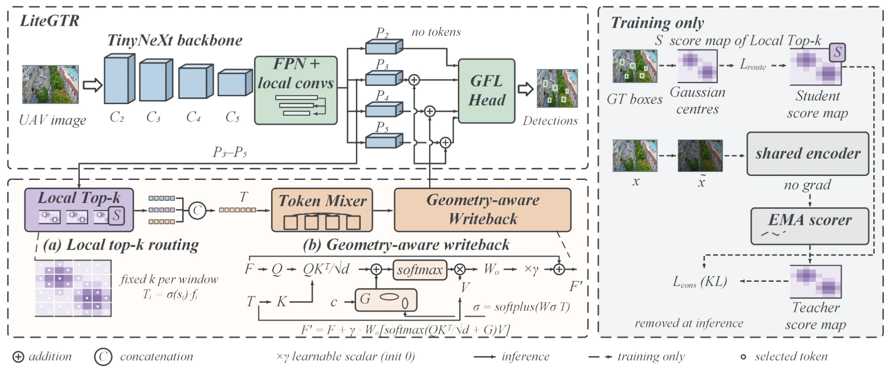

# LiteGTR

> [!WARNING]
> **Work in progress.** This repository is in an early stage of construction and debugging
> and still contains many undiscovered issues. It is being continuously revised and updated
> with the help of Claude. Code, configurations and results may change at any time.
> The complete version will be presented in this README once it has been finalised.
>
> **开发中。** 本仓库仍处于初期构建与调试阶段，存在许多尚未发现的问题。
> 作者正在借助 Claude 持续修改和更新，代码、配置与结果可能随时变动。完整版本确认后会在readme中展示。

**Li**ghtweight **G**lobal-**T**oken **R**efinement for UAV object detection —
a single-modality (RGB) detector for edge deployment.

<p align="center">
  
</p>

* **Local top-k routing** — each score map is cut into windows and a fixed number of
  tokens is taken from every window, so the graph has static shapes (ONNX / TensorRT).
* **Geometry-aware writeback** — tokens are written back through attention whose logits
  carry an axis-aligned Gaussian prior around each token's source position, with a
  per-token learned extent: `F' = F + γ · W_o[softmax(QKᵀ/√d + G) V]`.
* **Routing supervision** (training only) — score maps are supervised by GT-centre
  heat maps and aligned with an EMA teacher that sees a brightness / contrast / gamma /
  noise-perturbed view. Neither exists in the exported graph.

Design rationale, locked decisions and measured budgets: **[docs/DESIGN.md](docs/DESIGN.md)**.

## Install

```bash
pip install -r requirements.txt   # install torch separately to match your CUDA
```

## Training entry points

Three entry points, identical training logic (all drive `engine/trainer.py`):

| | how it is configured | use it for |
|---|---|---|
| **`train_litegtr.py`** | constants at the top of the file; edit and run | day-to-day experiments |
| `run_experiments.py` | list of experiments at the top; calls `train_litegtr.py` once per entry | the whole paper batch: main model, ablations, baselines |
| `tools/train.py` | everything from YAML, passed on the command line | DroneVehicle and other scripted runs |

```bash
python train_litegtr.py                  # set DATA_ROOT and MODEL_CONFIG at the top first
python run_experiments.py --dry-run      # status of every experiment and the command it would run
python run_experiments.py                # run them all, in order
```

* To run an ablation, change `MODEL_CONFIG` and `NAME` together; keep every training
  constant identical across runs so differences are attributable to the model.
* To resume, set `RESUME` to `runs/train/<NAME>/weights/last.pt` with all other
  constants unchanged -- the model config must match, or resuming fails loudly.
* `run_experiments.py` can be interrupted at any time: finished runs are skipped,
  half-finished ones resume from `last.pt`. A `runs/train/<NAME>/` produced by a
  *different* config is reported as a conflict and left untouched -- never resumed,
  skipped or overwritten. Best metrics of all runs are collected in
  `runs/train/experiments_summary.csv`.

> **Retrain after updating.** Runs made before the small-object assignment fix
> (`assigner.stal_size`, see below) are not comparable with current ones -- including
> the first 200-epoch run, which therefore cannot serve as the `no_routing_supervision`
> ablation (`configs/ablation/README.md`).

## Evaluation protocol

All evaluation -- validation during training, `tools/val.py`, `tools/test.py` and
`tools/submit_visdrone.py` -- post-processes through the one `test:` block in
`configs/_base_/schedule.yaml`:

| key | default | |
|---|---|---|
| `score_thr` | `0.001` | |
| `nms_iou` | `0.7` | class-wise NMS |
| `max_det` | `300` | |
| `multi_label` | `true` | one location may output several classes (pedestrian *and* people) |
| `agnostic` | `false` | class-agnostic NMS costs ~1.3 mAP on VisDrone |
| `containment` | `null` | e.g. `0.8` drops a box ≥ 80 % covered by a higher-scoring one |

Scoring follows mmdet / mmyolo's `CocoMetric`, as used by RemDet (AAAI'25):

| | |
|---|---|
| coordinates | predictions mapped back through the letterbox; GT = the original annotation, before resizing |
| size buckets | COCO small < 32² ≤ medium < 96² ≤ large, in **original-image** pixels, plus AI-TOD's `AP_vt` (2–8 px) and `AP_t` (8–16 px) |
| detections counted | up to **1000** per image (`maxDets` 100/300/1000), so every one of the 300 kept boxes counts |
| VisDrone ignore regions | painted out for training (`ignore_mode: mask`); evaluation images untouched (`eval_ignore_mode: drop`), as in a COCO-json evaluation |

Numbers from before this protocol (input-space buckets, 100 detections per image,
painted evaluation images) are not comparable with current ones or with published
results; re-evaluate old checkpoints with `tools/val.py`.

This post-processing is the protocol of RemDet (mmyolo) and Ultralytics YOLO val, so numbers are
comparable with theirs. It maximises recall for mAP and is **not** meant for drawing:
multi-label output puts a *pedestrian* and a *people* box on the same person, and nested
boxes on one tall object survive class-wise NMS.

Drawings (`val_predictions/` at the end of training, `tools/val.py` / `tools/test.py
--save-dir`) therefore pass through a separate `vis:` block -- score ≥ 0.3,
class-agnostic NMS 0.6, containment 0.8, class names without scores -- so a figure
shows one box per object. It never touches a metric. To redraw an existing checkpoint:

```bash
python tools/test.py --config configs/datasets/visdrone_rgb.yaml configs/models/model_main.yaml \
    --weights runs/train/<name>/weights/best.pt --split val --save-dir runs/vis/<name>
```

**Small-object assignment.** `assigner.stal_size: 8` widens, for candidate selection
only, any GT side shorter than 8 px (STAL, Ultralytics YOLO26). Without it about 3 %
of VisDrone val boxes at 640 input contain no anchor point and can never become
positives -- almost all under 4 px, where a third of the boxes are affected.

## Diagnosing predictions

Why does a checkpoint draw the boxes it draws, and which post-processing suits it?
One pass over the validation set, no retraining:

```bash
python tools/diagnose_predictions.py --config configs/datasets/visdrone_rgb.yaml \
    configs/models/model_main.yaml --weights runs/train/<name>/weights/best.pt \
    --out runs/diagnose/<name>

# assignment coverage only -- no weights needed
python tools/diagnose_predictions.py --config configs/datasets/visdrone_rgb.yaml \
    configs/models/model_main.yaml
```

It writes `diagnosis.txt` and `postprocess_sweep.csv` with

1. **coverage** -- GT boxes with no candidate point, by size, with and without STAL;
2. **box types** at score ≥ 0.25 -- correct, duplicate, wrong class, poorly localised,
   background -- and boxes vs. GT per image;
3. **post-processing sweep** -- mAP, AP_S and boxes per image for several score /
   NMS / multi-label / containment variants.

## Quick start

**1. Check the budget before anything else.**

```bash
python tools/profile_model.py --search                              # analytic sweep, no torch needed
python tools/profile_model.py --config configs/models/model_main.yaml --out runs/profile
```

**2. Measure your data before trusting the token budget.**

```bash
python tools/analyze_dataset.py --config configs/datasets/visdrone_rgb.yaml \
    configs/models/model_main.yaml --split train
```

Prints objects-per-image percentiles, COCO size buckets and class balance, then
compares them against the configured token budget. If it reports fewer tokens
than objects on a typical image, sweep the budget before anything else.

**3. Prepare data.**

VisDrone needs no preprocessing — point `configs/datasets/visdrone_rgb.yaml` (or
`DATA_ROOT` in `train_litegtr.py`) at the folder holding the `VisDrone2019-DET-*` splits.

DroneVehicle needs **no preprocessing** either — point the config at the original
download. Annotations are read natively from the XML and cached once; the 100-px
white margin is cropped losslessly at load time.

Optional, before the cross-illumination table:

```bash
python -m datasets.prepare.make_conditions \
    --img-dir <root>/val/rgb --out <root>/val/conditions.txt
```

Then check alignment by eye — for either dataset:

```bash
python tools/visualize_labels.py --config configs/datasets/dronevehicle_rgb.yaml \
    --split train --num 20 --out runs/label_check
```

Open `runs/label_check/`. Boxes must sit **on** the objects. A border offset that
was never applied does not raise an error — it just trains a wrong model.

**4. Check the token budget early.**

Train `configs/ablation/token_budget_256.yaml` next to the main model (56 tokens).
If 256 is clearly better, the main model should use more tokens — find that out
before the rest of the ablations. The five ablations the paper needs are indexed
in `configs/ablation/README.md`; `run_experiments.py` runs them in that order.

**5. Train, compare against baselines, evaluate, export.**

```bash
python tools/train.py --config configs/datasets/visdrone_rgb.yaml configs/models/model_main.yaml

# baselines run the SAME neck, head, losses, assigner, augmentation and schedule
python tools/train.py --config configs/datasets/visdrone_rgb.yaml configs/baselines/csp_n.yaml
python tools/train.py --config configs/datasets/visdrone_rgb.yaml configs/ablation/no_global_token.yaml

python tools/val.py   --config configs/datasets/visdrone_rgb.yaml configs/models/model_main.yaml \
                      --weights runs/train/<name>/weights/best.pt
python tools/test.py  --config configs/datasets/visdrone_rgb.yaml configs/models/model_main.yaml \
                      --weights runs/train/<name>/weights/best.pt --save-dir runs/test/<name>
python tools/run_seeds.py --config configs/datasets/visdrone_rgb.yaml configs/models/model_main.yaml \
                          --seeds 0 1 2
python tools/export_onnx.py --config configs/models/model_main.yaml --weights ... --simplify
python tools/benchmark_latency.py --config configs/models/model_main.yaml --imgsz 640
python tools/submit_visdrone.py --config configs/datasets/visdrone_rgb.yaml \
    configs/models/model_main.yaml --weights ... --split test --out runs/submit
```

## Layout

```
configs/    _base_ / datasets / models / ablation / baselines   — every variant is a YAML key
datasets/   base · builder · visdrone · dronevehicle · transforms · metrics · prepare/
models/     backbone (tinynext + builder) · baselines/ · neck · token · head · detector · build
losses/     qfl · giou · dfl · token_consistency · token_routing
assigners/  task_aligned_assigner (with STAL)
engine/     trainer · evaluator · ema · checkpoint · recorder
tools/      profile_model · analyze_dataset · visualize_labels · train · val · test
            diagnose_predictions · run_seeds · export_onnx · benchmark_latency
            submit_visdrone · inspect_tokens · visualize_tokens
train_litegtr.py    edit-and-run training entry (constants at the top)
run_experiments.py  the full experiment batch, resumable
utils/      budget (analytic) · boxes (letterbox inverse, IoU) · plots
tests/      param budget · static ONNX · shapes/backward · AMP · resume · routing
            · duplicates & tiny objects · baselines · config · entry scripts
```

## Run output

```
runs/train/<name>/
├── weights/{best,last,epoch_xx}.pt   # best.pt / last.pt carry the EMA weights and the config
├── results.csv / results.png
├── results_by_condition.csv          # day / night / dark (DroneVehicle with conditions.txt)
├── token_stats.csv                   # score entropy, EMA agreement -- entropy near 1.0 = flat maps
├── best_metrics.json / args.yaml / training.log
└── confusion_matrix.png / pr_curve.png / val_predictions/   # final epoch
```

## Notes

* Windows-native: `pathlib` throughout, no shell dependencies, main-guarded entry points.
* Dataset roots live in YAML (or `DATA_ROOT`), never in code.
* `pytest tests/` — `test_param_budget.py` fails if the model outgrows its budget;
  `test_onnx_export.py` fails if the token path acquires dynamic shapes.
* Paper drafts are kept out of the repository (`docs/paper/` and `*.docx` are ignored).
